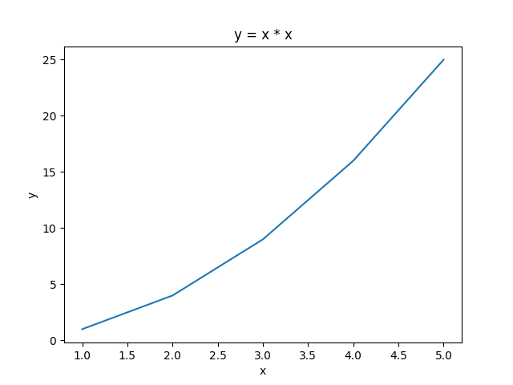
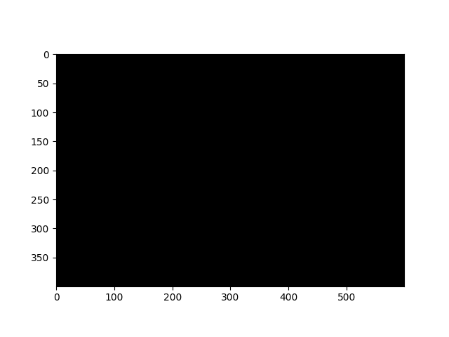
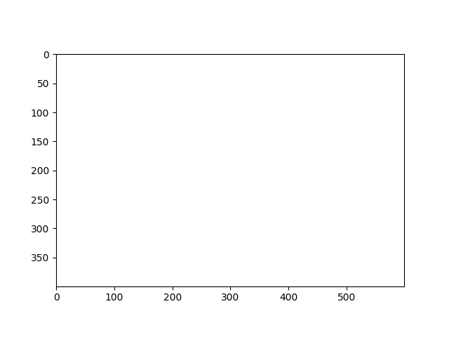
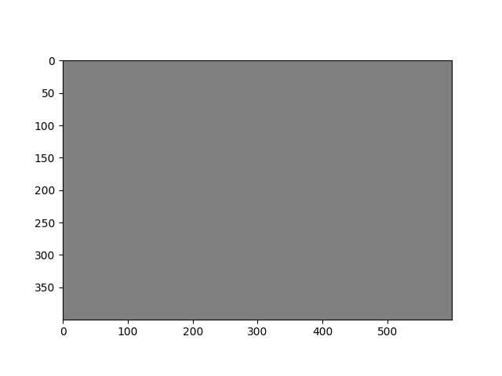

### ライブラリ
- Pythonにはライブラリとよばれる「プログラムの集まり」が用意されている
- このライブラリを利用することで，様々な機能を持つプログラムを簡単に作成できるようになる
  - Pythonには使用しやすい有名なライブラリが多い
- ライブラリは2種類に大別される
1. 標準ライブラリ: Pythonをインストールした際に付属しているライブラリ
  - 例: ``math``（数学機能），``random``（乱数機能）
2. 外部ライブラリ: 新たにダウンロードしてインストールが必要なライブラリ
  - 例: ``matplotlib``（グラフ機能），``pytorch``（深層学習），``opencv``（画像処理）

#### ライブラリの使用例
- ライブラリを導入する場合，最初に``import ライブラリ名``と書く
- ライブラリに含まれる機能を使用するには，ドット ``.`` を打ち，機能名を続けることで使用することができる
```python
# 累乗と平方根を求めるmathライブラリのpow()，sqrt()の使用例
import math # mathライブラリの導⼊
# math.pow(a, b) # aのb乗
print(math.pow(2, 5)) # 2の5乗
# math.sqrt(a) # ルートa
print(math.sqrt(2)) # 2の平⽅根（ルート2）
```
```
32.0
1.4142135623730951
```

#### ライブラリの使用例
- ``as`` を使用することで，ライブラリに別名をつけて使用できる
```python
# mathライブラリをmという別名をつけた場合における
# 累乗と平方根を求めるpow()，sqrt()の使用例
import math as m   # mathライブラリをmとして導⼊
print(m.pow(2, 5)) # 2の5乗
print(m.sqrt(2))   # 2の平⽅根（ルート2）
```

#### randomライブラリ
- Pythonでランダムな処理が必要な場合に使用するランダムな数字のことを乱数とよぶ
- ``random``ライブラリ: 乱数を扱う標準ライブラリ
- サイコロを振るなどの『確率』をプログラムで扱う場合，このような処理が必要となる
  - ``random.randint(a, b)``: a ≦ n ≦ b であるようなランダムな整数nを作成する
  - ``random.choice(リスト変数名)``: リストにある値をランダムに取り出すことができる
```python
import random
# ランダムに1以上6以下の整数を1回出⼒する
# 結果は毎回異なる
print(random.randint(1, 6))
```

#### calendarライブラリ
- calendarに関する処理に特化した標準ライブラリ
  - ``calendar.month(年, 月)`` でその年月のカレンダー情報を得ることができる
```python
import calendar
print(calendar.month(2025, 9)) # 2025年9月のカレンダーを表示
```
- 出力結果
```
   September 2025
Mo Tu We Th Fr Sa Su
 1  2  3  4  5  6  7
 8  9 10 11 12 13 14
15 16 17 18 19 20 21
22 23 24 25 26 27 28
29 30
```

#### matplotlibライブラリ
- グラフ作成に特化した外部ライブラリ
  - 様々なグラフを出力することができるが，デフォルトの設定では，折れ線グラフとなる
- **matplotlibをimportする場合，matplotlib.pyplotをpltとしてimportすることが多い**
```python
import matplotlib.pyplot as plt
```

- リスト構造に格納された値をグラフとして可視化する例
  - インデックスに対応した関係のグラフとなる
  - 例: ``x = [1, 2, 3, 4, 5]`` ``y = [1, 4, 9, 16, 25]`` ``plt.plot(x, y)``とした場合，
    - 横軸x, 縦軸y, (1, 1) (2, 4) (3, 9) (4, 16) (5, 25) を通る折れ線グラフになる
```python
import matplotlib.pyplot as plt # ライブラリの導⼊
x = [1, 2, 3, 4, 5]             # x軸の値
y = [1, 4, 9, 16, 25]           # y軸の値
plt.xlabel('x')                 # x軸の名前の設定（文字列）
plt.ylabel('y')                 # y軸の名前の設定（文字列）
plt.title('y = x * x')          # タイトルの設定（文字列）
plt.plot(x, y)                  # 折れ線グラフの作成
plt.show()                      # 作成したグラフの表⽰
```



#### NumPyライブラリ
- 数値データを高速に処理するための外部ライブラリ
  - ベクトル・行列演算を得意としている
  - 画像処理の画素を扱うときによく利用される
- **numpyをimportする場合，npとしてimportすることが多い**
```python
import numpy as np
```
- ``np.zeros((高さ, 幅, 3), np.uint8)``とすることで，解像度 幅×高さ，RGB要素の値を0として初期化する
  - つまり，解像度 幅×高さの黒画像を作成するという意味になる
  - 最後の3はRとGとBの3種類から3と指定している
  - ``np.uint8`` は 8bitで正の整数（0〜255）を扱うという意思表示
- ``plt.imshow(変数)``とすることで，グラフ内に変数管理している画素で構成された画像を作成する
- ``plt.show()``とすることで，グラフを表示する

```python
import numpy as np
import matplotlib.pyplot as plt # ライブラリの導⼊

black_image = np.zeros((400, 600, 3), np.uint8)
plt.imshow(black_image)
plt.show()
```



```python
import numpy as np
import matplotlib.pyplot as plt # ライブラリの導⼊

white_image = np.full((400, 600, 3), 255, np.uint8)
plt.imshow(white_image)
plt.show()
```


```python
import numpy as np
import matplotlib.pyplot as plt # ライブラリの導⼊

gray_image = np.full((400, 600, 3), 128, np.uint8)
plt.imshow(gray_image)
plt.show()
```


