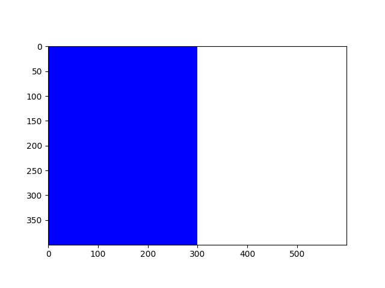

### ライブラリ
- Pythonにはライブラリとよばれる「プログラムの集まり」が用意されている
- このライブラリを利用することで，様々な機能を持つプログラムを簡単に作成できるようになる
  - Pythonには使用しやすい有名なライブラリが多い
- ライブラリは2種類に大別される
1. 標準ライブラリ: Pythonをインストールした際に付属しているライブラリ
  - 例: ``math``（数学機能），``random``（乱数機能）
2. 外部ライブラリ: 新たにダウンロードしてインストールが必要なライブラリ
  - 例: ``matplotlib``（グラフ機能），``pytorch``（深層学習），``opencv``（画像処理）

#### ライブラリの使用例
- ライブラリを導入する場合，最初に``import ライブラリ名``と書く
- ライブラリに含まれる機能を使用するには，ドット ``.`` を打ち，機能名を続けることで使用することができる
```python
# 累乗と平方根を求めるmathライブラリのpow()，sqrt()の使用例
import math # mathライブラリの導⼊
# math.pow(a, b) # aのb乗
print(math.pow(2, 5)) # 2の5乗
# math.sqrt(a) # ルートa
print(math.sqrt(2)) # 2の平⽅根（ルート2）
```
```
32.0
1.4142135623730951
```

#### ライブラリの使用例
- ``as`` を使用することで，ライブラリに別名をつけて使用できる
```python
# mathライブラリをmという別名をつけた場合における
# 累乗と平方根を求めるpow()，sqrt()の使用例
import math as m   # mathライブラリをmとして導⼊
print(m.pow(2, 5)) # 2の5乗
print(m.sqrt(2))   # 2の平⽅根（ルート2）
```

#### randomライブラリ
- Pythonでランダムな処理が必要な場合に使用するランダムな数字のことを乱数とよぶ
- ``random``ライブラリ: 乱数を扱う標準ライブラリ
- サイコロを振るなどの『確率』をプログラムで扱う場合，このような処理が必要となる
  - ``random.randint(a, b)``: a ≦ n ≦ b であるようなランダムな整数nを作成する
  - ``random.choice(リスト変数名)``: リストにある値をランダムに取り出すことができる
```python
import random
# ランダムに1以上6以下の整数を1回出⼒する
# 結果は毎回異なる
print(random.randint(1, 6))
```

#### calendarライブラリ
- calendarに関する処理に特化した標準ライブラリ
  - ``calendar.month(年, 月)`` でその年月のカレンダー情報を得ることができる
```python
import calendar
print(calendar.month(2025, 9)) # 2025年9月のカレンダーを表示
```
- 出力結果
```
   September 2025
Mo Tu We Th Fr Sa Su
 1  2  3  4  5  6  7
 8  9 10 11 12 13 14
15 16 17 18 19 20 21
22 23 24 25 26 27 28
29 30
```

#### matplotlibライブラリ
- グラフ作成に特化した外部ライブラリ
  - 様々なグラフを出力することができるが，デフォルトの設定では，折れ線グラフとなる
- **matplotlibをimportする場合，matplotlib.pyplotをpltとしてimportすることが多い**
```python
import matplotlib.pyplot as plt
```

- リスト構造に格納された値をグラフとして可視化する例
  - インデックスに対応した関係のグラフとなる
  - 例: ``x = [1, 2, 3, 4, 5]`` ``y = [1, 4, 9, 16, 25]`` ``plt.plot(x, y)``とした場合，
    - 横軸x, 縦軸y, (1, 1) (2, 4) (3, 9) (4, 16) (5, 25) を通る折れ線グラフになる
```python
import matplotlib.pyplot as plt # ライブラリの導⼊
x = [1, 2, 3, 4, 5]             # x軸の値
y = [1, 4, 9, 16, 25]           # y軸の値
plt.xlabel('x')                 # x軸の名前の設定（文字列）
plt.ylabel('y')                 # y軸の名前の設定（文字列）
plt.title('y = x * x')          # タイトルの設定（文字列）
plt.plot(x, y)                  # 折れ線グラフの作成
plt.show()                      # 作成したグラフの表⽰
```


#### NumPyライブラリ
- 数値データを高速に処理するための外部ライブラリ
  - ベクトル・行列演算を得意としている
  - 画像処理の画素を扱うときによく利用される
- **numpyをimportする場合，npとしてimportすることが多い**
```python
import numpy as np
```
#### 黒画像の作成
- ``np.zeros((高さ, 幅, 3), np.uint8)``とすることで，解像度 幅×高さ，RGB要素の値を0として初期化する
  - つまり，解像度 幅×高さの黒画像を作成するという意味になる
  - 最後の3はRとGとBの3種類から3と指定している
  - ``np.uint8`` は 8bitで正の整数（0〜255）を扱うという意思表示
- ``plt.imshow(変数)``とすることで，グラフ内に変数管理している画素で構成された画像を作成する
- ``plt.show()``とすることで，グラフを表示する

```python
import numpy as np
import matplotlib.pyplot as plt # ライブラリの導⼊

black_image = np.zeros((400, 600, 3), np.uint8)
plt.imshow(black_image)
plt.show()
```


#### 白画像の作成
- ``np.fill((高さ, 幅, 3), num, np.uint8)`` とすることで，解像度:幅×高さ，RGB要素の値をnumとして初期化する
  - つまり，``np.fill((高さ, 幅, 3), 255, np.uint8)``は，numが255なので，解像度:幅×高さの白画像を作成するという意味になる
```python
import numpy as np
import matplotlib.pyplot as plt # ライブラリの導⼊

white_image = np.full((400, 600, 3), 255, np.uint8)
plt.imshow(white_image)
plt.show()
```


#### グレー画像の作成
- RGBの各要素が128の場合，灰色画像になる
  - つまり，``np.fill((400, 600, 3), 128, np.uint8)``は，numが128なので，解像度 600×400の灰色画像を作成するという意味になる
```python
import numpy as np
import matplotlib.pyplot as plt # ライブラリの導⼊

gray_image = np.full((400, 600, 3), 128, np.uint8)
plt.imshow(gray_image)
plt.show()
```


#### 画素値操作
- ``np.zero``や``np.full``で代入した変数に対して，``変数[高さ番号][幅番号][色要素番号]``を指定することで，色を変更することができる
- 色要素番号は以下の通り（**0から始まるため，3を指定するとエラーになることに注意**）
  - 0: 赤要素
  - 1: 緑要素
  - 2: 青要素
- グラフの目盛は自動的に付けられるので，現段階では無視して良い
```python
import numpy as np
import matplotlib.pyplot as plt # ライブラリの導⼊
image = np.zeros((2, 3, 3), np.uint8) # 黒画像を作成
image[0][0][0] = 255 # 高さ0, 幅0の画素の赤要素を255にする
image[0][1][1] = 255 # 高さ0, 幅1の画素の緑要素を255にする
image[1][2][2] = 255 # 高さ1, 幅2の画素の青要素を255にする
plt.imshow(image)
plt.show()
```


#### OpenCVライブラリ

- 画像処理，コンピュータビジョンを行う外部ライブラリ
- ``cv2``をimportすることで使用できる

```python
import cv2
```
#### 線分描画
- ``cv2.line(変数名, (x0座標，y0座標), (x1座標，y1座標), (赤要素, 緑要素, 青要素), 太さ)``で, 指定した太さ，色で(x0, y0)から(x1, y1)に線分を描くことができる
```python
import cv2
import numpy as np
import matplotlib.pyplot as plt # ライブラリの導⼊
image = np.full((400, 600, 3), 255, np.uint8) # 白画像を作成

# 緑色, 太さ5で座標(0, 0)から座標(600, 400)に直線を引く
cv2.line(image, (0, 0), (600, 400), (0, 255, 0), 5)
plt.imshow(image)
plt.show()
```


#### 長方形描画
- ``cv2.rectangle(変数名, (左上のx座標，左上のy座標, 長方形の幅，長方形の高さ), (赤要素, 緑要素, 青要素), -1)``で, 指定した色で，指定した左上頂点(x, y)とし，指定した幅，高さの長方形を描くことができる（-1を整数値にすると枠だけを描く，3にすると枠線の太さ3となる）
```python
import cv2
import numpy as np
import matplotlib.pyplot as plt # ライブラリの導⼊
image = np.full((400, 600, 3), 255, np.uint8) # 白画像を作成

# 青色, 座標(0, 0)を長方形の左上の座標とした，幅300, 高さ400の長方形を描く
cv2.rectangle(image, (0, 0, 300, 400), (0, 0, 255), -1)
plt.imshow(image)
plt.show()
```


```python
import cv2
import numpy as np
import matplotlib.pyplot as plt # ライブラリの導⼊
image = np.full((400, 600, 3), 255, np.uint8) # 白画像を作成
# 赤枠（太さ10）, 座標(300, 0)を長方形の左上の座標とした，幅300, 高さ400の長方形を描く
cv2.rectangle(image, (300, 0, 300, 400), (255, 0, 0), 10)
plt.imshow(image)
plt.show()
```


#### 円描画
- ``cv2.circle(変数名, (中心のx座標，中心のy座標), 半径, (赤要素, 緑要素, 青要素), -1)``で, 指定した色で，指定した中心座標(x, y)とし，指定した半径の円を描くことができる（-1を整数値にすると枠だけを描く，3にすると枠線の太さ3となる）
```python
import cv2
import numpy as np
import matplotlib.pyplot as plt # ライブラリの導⼊
image = np.full((400, 600, 3), 255, np.uint8) # 白画像を作成
# 緑色, 中心座標(200, 200)で半径50の円を描く
cv2.circle(image, (200, 200), 50, (0, 255, 0), -1)
plt.imshow(image)
plt.show()
```


```python
import cv2
import numpy as np
import matplotlib.pyplot as plt # ライブラリの導⼊
image = np.full((400, 600, 3), 255, np.uint8) # 白画像を作成
# 青枠, 太さ20, 中心座標(400, 200)で半径60の円を描く
cv2.circle(image, (400, 200), 60, (0, 0, 255), 20)
plt.imshow(image)
plt.show()
```


- プログラムは上から下に順番に実行されるため，**最初に描いた図形が最背面，最後に描いた図形が最前面となる**

```python
import cv2
import numpy as np
import matplotlib.pyplot as plt # ライブラリの導⼊
image = np.full((400, 600, 3), 255, np.uint8) # 白画像を作成
cv2.circle(image, (250, 200), 60, (255, 255, 0), 20)
cv2.circle(image, (300, 200), 60, (0, 0, 255), 20)
plt.imshow(image)
plt.show()
```


```python
import cv2
import numpy as np
import matplotlib.pyplot as plt # ライブラリの導⼊
image = np.full((400, 600, 3), 255, np.uint8) # 白画像を作成
cv2.circle(image, (300, 200), 60, (0, 0, 255), 20)
cv2.circle(image, (250, 200), 60, (255, 255, 0), 20)
plt.imshow(image)
plt.show()
```

