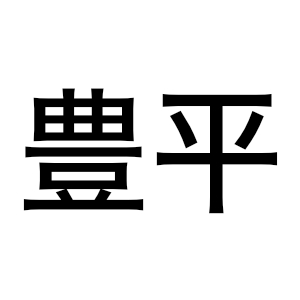
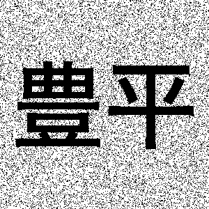
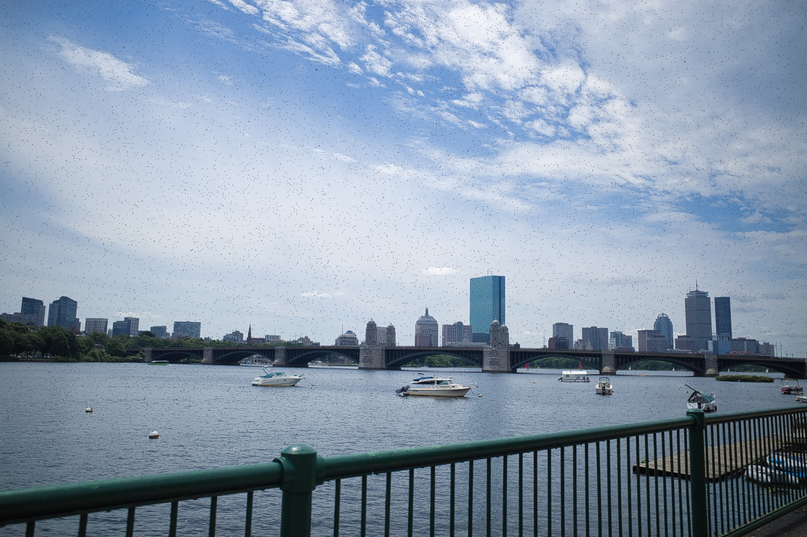
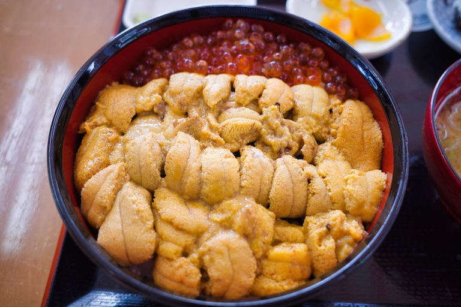
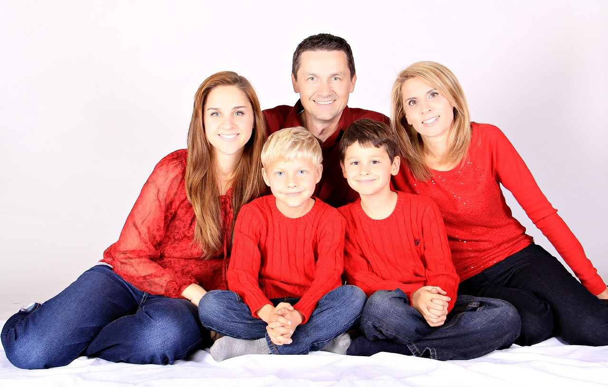

## 演習1
- OpenCVライブラリを使って以下の画像を作成してください
  1. 解像度3×3

     
     
  2. 解像度600×400で，日本国旗

     
     
  3. 解像度800×600で，ドイツ国旗
     
     

## 演習2
1. 以下の画像を表すPGMファイルを作成し，その画像をOpenCVとmatplotlibで表示しなさい

2. 以下の画像を表すPPMファイルを作成し，その画像をOpenCVとmatplotlibで表示しなさい

## 演習3
- 以下の画像``ex3.jpeg``に対して以下の処理を行いさい

1. グレースケール画像に変換して表示しなさい
2. OpenCVを使用してグレースケール画像に変換した画素値のヒストグラムを作成しなさい
3. グレースケール画像に変換した画素値に対してヒストグラム均一化を行った画像を表示しなさい
4. 得られたヒストグラム均一化を行った画像の画素値のヒストグラムを作成しなさい

## 演習4
- 以下の画像``ex4.jpeg``に対して以下の処理を行いさい

- グレースケール画像に変換して各処理を行ってください
	1. ネガポジ変換
	2. ガンマ変換（γ = 1.5）
	3. ガンマ変換（γ = 0.3）
	4. 折れ線型トーンカーブ (a = 65, b = 190)
	5. ポスタリゼーション（8段階）
	6. 明度調整（a = 2, b = 150 ）
	7. コントラスト低減（画素値を0から20にする）
	8. ソラリゼーション
- グレースケール画像に変更せず，``ex4.jpeg``のRGBの画素値に対して
	1. Rの画素値をすべて0にする
	2. RとGの画素値をすべて0にする
	3. Bの画素値に対してガンマ変換（γ = 1.5）

## 演習5
- 以下の画像を参考にして，``ex3.jpeg``に対してマスク処理を行ってください．

## 演習6
- 以下の画像を参考にして，``ex6.jpg``に対して以下の処理を行いさい

1. 緑色だけを抽出し，「あいうえお」だけを抽出し，表示する
2. 黄色だけを抽出し，「ABCDEF」だけを抽出し，表示する
3. 赤色と青色を抽出し，「123456」だけを抽出し，表示する
4. 「7890」と「かきくけこ」と「GHIJKL」だけを抽出し，表示する

## 演習7
A. 以下の画像``ex7-a.jpg``に対して以下の処理を行いさい
- カーネルを使う場合，3×3の十字のカーネルを使用すること

1. 2回の膨張処理を行いなさい
2. 2回の収縮処理を行いなさい
3. モルフォロジー勾配（2回）を行い，白黒反転（白を黒，黒を白に変換する）を行いなさい

B. 以下の画像``ex7-b.jpg``に対して，可能な限りノイズを除去しなさい
- カーネルを使う場合，3×3の十字のカーネルを使用すること

C. 以下の画像``ex7-c.jpg``に対して，可能な限りノイズを除去しなさい
- カーネルを使う場合，3×3の十字のカーネルを使用すること

## 演習8
A. 以下の画像``ex8-a.jpg``に対して，可能な限り黒色ノイズを除去しなさい

B. 以下の画像``ex8-b.jpg``に対して，鮮鋭化フィルタを適用しなさい

## 演習9
- 以下の画像``ex9.jpg``に対して，YuNetによる顔検出を適用して顔検知を行いなさい，さらに，各検知結果に対して，バウンディングボックスの色を変え，左目を強調して表示し，検知信頼度を出力しなさい．

