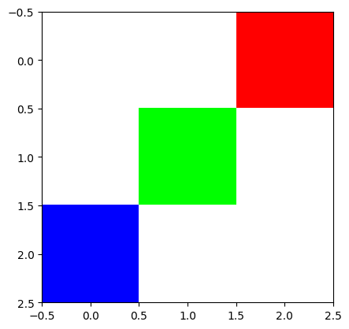
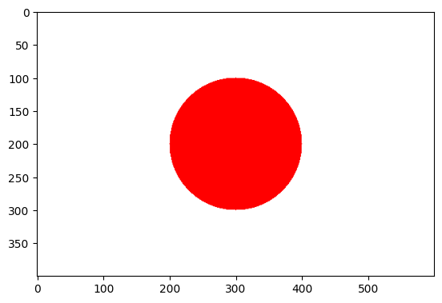
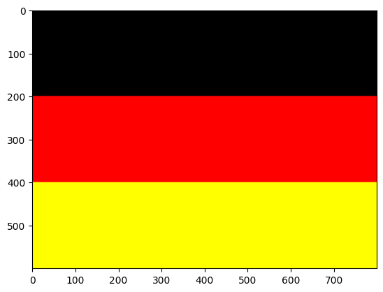
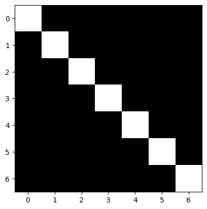
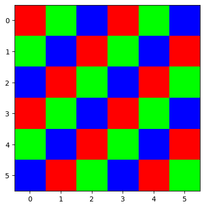

#### 演習1
- OpenCVライブラリを使って以下の画像を作成してください
  1. 解像度3×3

     
     
  2. 解像度600×400で，日本国旗

     
     
  3. 解像度800×600で，ドイツ国旗
     
     

#### 演習2
1. 以下の画像を表すPGMファイルを作成し，その画像をOpenCVとmatplotlibで表示しなさい

2. 以下の画像を表すPPMファイルを作成し，その画像をOpenCVとmatplotlibで表示しなさい

#### 演習3

